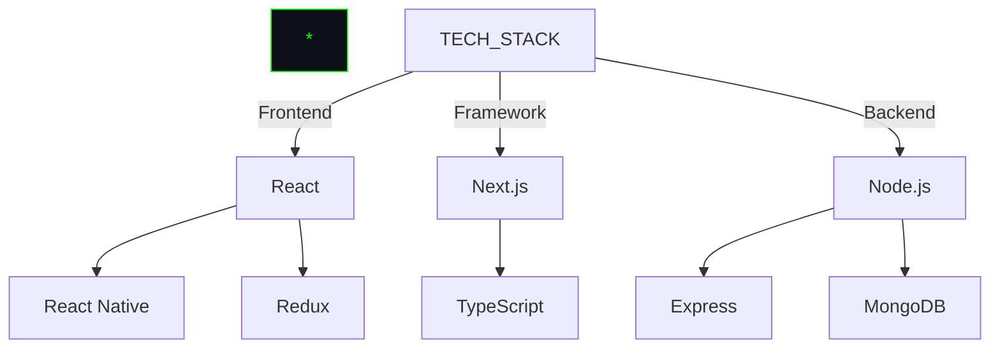
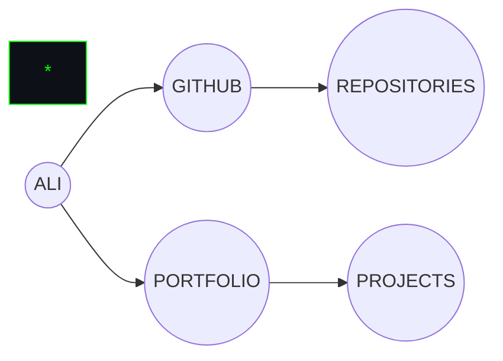

```
<div align="center">

```ascii
    ⠀⠀⠀⠀⠀⠀⠀⠀⣀⣠⣤⣤⣤⣤⣤⣀⡀⠀⠀⠀⠀⠀⠀⠀⠀
    ⠀⠀⠀⠀⢀⣤⣾⣿⣿⣿⣿⣿⣿⣿⣿⣿⣿⣷⣤⡀⠀⠀⠀⠀⠀
    ⠀⠀⠀⣴⣿⣿⣿⣿⣿[ALI SIDDIQUE]⣿⣿⣿⣿⣦⠀⠀⠀⠀
    ⠀⢀⣾⣿⣿⣿⣿⣿⣿⣿⣿⣿⣿⣿⣿⣿⣿⣿⣿⣿⣷⡀⠀⠀⠀
    ⣠⣿⣿⣿⣿⣿⣿⣿⣿⣿⣿⣿⣿⣿⣿⣿⣿⣿⣿⣿⣿⣿⣄⠀⠀
```

# > SYSTEM INITIALIZED
## > FULLSTACK DEVELOPER | REACT SPECIALIST | NEXT.JS ARCHITECT

</div>

# > CORE_SYSTEMS.exe



# > PROJECT_MATRIX

```ascii
┌──────────────────────────────────────────┐
│ [█] Chatbot App: Next.js Implementation  │
│ [█] YouTube Clone: React Video Platform  │
│ [█] Twitter Clone: Social Network Core   │
│ [█] E-Commerce: Full Stack Development   │
└──────────────────────────────────────────┘
```

# > SKILL_ANALYSIS

<div align="center">

```ascii
┌────────────────────────┬────────────────┐
│ React/Next.js          │ ███████████░░  │
│ TypeScript            │ ██████████░░░  │
│ Node.js              │ ████████░░░░░  │
│ MongoDB              │ ███████░░░░░░  │
│ Express              │ ███████░░░░░░  │
└────────────────────────┴────────────────┘
```

</div>

# > GITHUB_METRICS

<div align="center">
  
</div>

# > TOP_LANGUAGES

<div align="center">
  
</div>

# > NETWORK_PROTOCOLS



# > LATEST_EXPLOITS

<div align="center">
  
</div>

# > CONTACT_VECTORS

```python
def initialize_contact():
    protocols = {
        "github": "https://github.com/AliSiddique",
        "portfolio": "[ENCRYPTED]"
    }
    return establish_connection(protocols)
```

<div align="center">
  
[![][github-shield]][github-url]

</div>

[github-shield]: https://img.shields.io/badge/-GitHub-0D1117?style=for-the-badge&logo=github&logoColor=00FF00
[github-url]: https://github.com/AliSiddique
```
