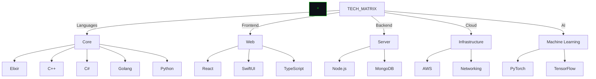

#  <div style="color: #00FF00; display: inline;">Hi there, I'm Ali</div>


</div>

# > CORE_SYSTEMS.map()



# > LANGUAGE_SIGNATURES

<div align="center">
  
</div>


# > NETWORK_TRACE

<div align="center">
  
</div>


<div align="center">
  
[![][github-shield]][github-url]

</div>

[github-shield]: https://img.shields.io/badge/-GitHub-0D1117?style=for-the-badge&logo=github&logoColor=00FF00
[github-url]: https://github.com/AliSiddique
```
