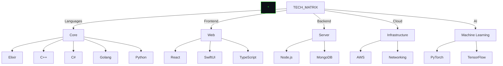

```
<div align="center">

```ascii
     ███████╗██╗   ██╗███████╗████████╗███████╗███╗   ███╗
     ██╔════╝╚██╗ ██╔╝██╔════╝╚══██╔══╝██╔════╝████╗ ████║
     ███████╗ ╚████╔╝ ███████╗   ██║   █████╗  ██╔████╔██║
     ╚════██║  ╚██╔╝  ╚════██║   ██║   ██╔══╝  ██║╚██╔╝██║
     ███████║   ██║   ███████║   ██║   ███████╗██║ ╚═╝ ██║
     ╚══════╝   ╚═╝   ╚══════╝   ╚═╝   ╚══════╝╚═╝     ╚═╝
```

```ascii
     [█ █ █ █ █ █ INITIALIZING NEURAL INTERFACE █ █ █ █ █ █]
           
     ▀▄▀▄▀▄ ALI SIDDIQUE : SYSTEM ARCHITECT ▄▀▄▀▄▀
     
     [......................................]
     [■■■■■■■■■■■□□□□□□□□□□] 50% complete
     [SCANNING NEURAL NETWORK........................]
     
     ▐▓░░░░░░░░░░░░░░░░░░░░░░░░░░░░░░░░░░░░░░░░░░░░▌
     ▐▓█░░░░░░░░░░░░░░░░░░░░░░░░░░░░░░░░░░░░░░░░░░░▌
     ▐▓██░░░░░░░░░░░░░░░░░░░░░░░░░░░░░░░░░░░░░░░░░░▌
     
     [STATUS: ACTIVE]    [UPTIME: 99.99%]    [PING: 0.2ms]
```

# > SYSTEM SPECIFICATIONS:
```ascii
┌───────────────────────────────────────────────────┐
│  KERNEL: TECH.STACK.v4.2.1                        │
│  CPU: MULTI-PARADIGM PROCESSING UNIT              │
│  RAM: INFINITE KNOWLEDGE BASE                     │
│  GPU: NEURAL NETWORK ACCELERATOR                  │
└───────────────────────────────────────────────────┘
```

</div>
```

# > SYSTEM BREACH SUCCESSFUL...
# > INITIATING PROFILE: ALI SIDDIQUE
# > ADVANCED TECH MATRIX DETECTED...

</div>

# > CORE_SYSTEMS.map()



# > SKILL_MATRIX

<div align="center">

```ascii
┌────────────────────────┬────────────────┐
│ Systems Programming    │ ████████████░  │
│ ├─ C++                │ ███████████░░  │
│ ├─ C#                 │ ███████████░░  │
│ ├─ Golang            │ ██████████░░░  │
│ Functional            │ ████████████░  │
│ ├─ Elixir            │ ███████████░░  │
│ Web Development       │ ████████████░  │
│ ├─ React             │ ████████████░  │
│ ├─ SwiftUI           │ ███████████░░  │
│ Cloud & DevOps        │ ████████████░  │
│ ├─ AWS               │ ████████████░  │
│ ├─ Networking        │ ███████████░░  │
│ AI & ML              │ ███████████░░  │
│ ├─ PyTorch           │ ███████████░░  │
│ ├─ Python            │ ████████████░  │
└────────────────────────┴────────────────┘
```

</div>

# > BREACH_ANALYTICS

<div align="center">
  
</div>

# > LANGUAGE_SIGNATURES

<div align="center">
  
</div>

# > MISSION_LOG

```ascii
┌──────────────────────────────────────────┐
│ [▓] Advanced Systems Architecture        │
│ [▓] Quantum Computing Research           │
│ [▓] Neural Network Implementation        │
│ [▓] Cloud Infrastructure Design          │
│ [▓] Distributed Systems Development      │
└──────────────────────────────────────────┘
```

# > NETWORK_TRACE

<div align="center">
  
</div>

# > ACCESS_PROTOCOLS

```python
def initialize_secure_channel():
    vectors = {
        "github": "https://github.com/AliSiddique",
        "status": "ACTIVE",
        "clearance_level": "ADVANCED",
        "specializations": [
            "Systems Programming",
            "Cloud Architecture",
            "AI Development",
            "Network Security"
        ]
    }
    return establish_encrypted_connection(vectors)
```

<div align="center">
  
[![][github-shield]][github-url]

</div>

[github-shield]: https://img.shields.io/badge/-GitHub-0D1117?style=for-the-badge&logo=github&logoColor=00FF00
[github-url]: https://github.com/AliSiddique
```
